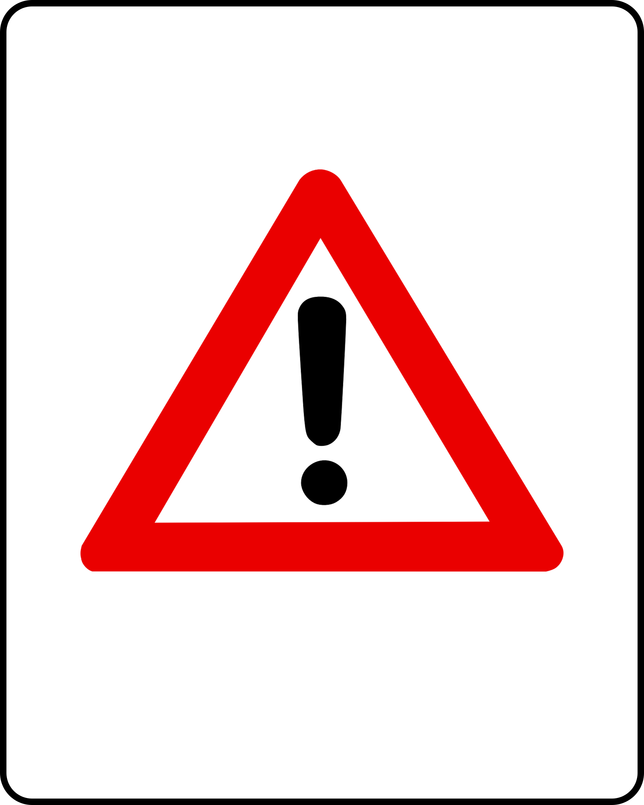
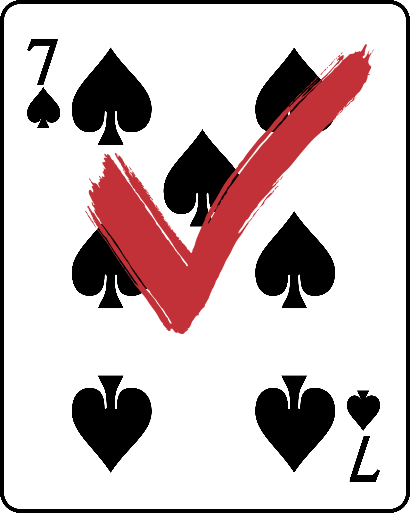

# 카드 찾기 게임 프로젝트

작성자 : **문성찬** (**20171620**)

------

## 목차

* 게임 설명

* 코드 설명

* 실행 화면

* 업그레이드 기능

* 제출물

  

------

## 게임 설명

1. 난이도를 설정합니다.

   > * 쉬움 : 8 * 3의 크기의 카드로 게임을 진행합니다.
   >
   > * 어려움 : 10 * 3의 크기의 카드로 게임을 진행합니다.

2. 게임 시작 버튼을 누릅니다.

   > * 정답과 오답 카드들이 무작위로 배치됩니다.
   >
   > * 이용자에게 정답화면을 일정 시간 보여줍니다.
   >
   > * 일정 시간이 지나고 제한된 시간내에 이용자는 정답을 모두 찾습니다.
   >
   > * 오답 수가 7 초과 시 GAME OVER하게 됩니다.
   >
   > * 시간 초과 시 마찬가지로 GAME OVER하게 됩니다.

3. 단계마다 제한 시간과 요소가 다릅니다.

   > * 정답을 보여주는 시간 : 모든 단계 공통 5초
   >
   > * 1단계 : 15초 (총 20초)
   >
   > * 2단계 : 10초 (총 15초)
   >
   > * 3단계 : 10초 (총 15초) + 함정 생성

4. 모든 단계를 CLEAR하도록 게임을 진행합니다.

   > * 중간에 GAME OVER 시 1단계 및 난이도 설정 순서로 다시 이동합니다.
   >
   > * 1,2단계 CLEAR 시 다음 단계로 진행합니다.
   >
   > * 모든 단계를 CLEAR 시 1단계 및 난이도 설정 순서로 다시 이동합니다.


------

## 코드 설명

###  findGame.css

> * HTML 문서 전체의 스타일 시트 작성
>
> ```css
> body {
>     background-color: darkgreen;
> }
> 
> h1 {
>     text-align: center;
>     color: white;
> }
> ```

------

> - 좌측에 위치한 점수판의 스타일 시트 작성
>
> * 좌측에 위치한 게임 버튼의 스타일 시트 작성
>
> ```css
> #left {
>     width: 150px;
>     padding: 20px;
> }
> 
> #left>div {
>     padding: 5px;
>     width: 150px;
>     background: white;
>     border: 1px solid black;
>     border-radius: 5px;
>     color: black;
>     text-align: left;
>     font-size: medium;
> }
> 
> #left>button {
>     padding: 5px;
>     background-color: lightyellow;
>     border: 1px solid black;
>     border-radius: 5px;
>     color: black;
>     text-align: left;
>     font-size: medium;
> }
> ```

------

> * 우측에 위치한 게임판의 스타일 시트 작성
>
> ```css
> #right {
>     background-color: palegreen;
>     border-radius: 5px;
> }
> 
> #right div {
>     padding: 5px;
> }
> ```

------

> * 성공, 실패, ALL CLEAR 시 표시할 텍스트의 스타일 시트 작성
>
> ```css
> #gameover {
>     position: absolute;
>     bottom: 70px;
>     left: 338px;
>     z-index: 2;
>     font: oblique bold 110px fantasy;
>     color: red;
>     text-shadow: 2px 2px 3px rebeccapurple, 0 0 35px seashell, 0 0 5px darkblue;
> }
> 
> #success {
>     position: absolute;
>     bottom: 70px;
>     left: 380px;
>     z-index: 2;
>     font: oblique bold 110px fantasy;
>     color: rgb(132, 207, 236);
>     text-shadow: 2px 2px 5px darkslateblue, 0 0 35px grey, 0 0 5px slateblue;
> }
> 
> #allClear{
>     position: absolute;
>     bottom: 70px;
>     left: 454px;
>     z-index: 2;
>     font: oblique bold 110px fantasy;
>     color: rgb(252, 241, 142);
>     text-shadow: 3px 3px 10px black, 0 0 50px rgb(94, 92, 94), 0 0 5px whitesmoke;
> }
> 
> #clearEasy{
>     position: absolute;
>     bottom: 230px;
>     left: 350px;
>     z-index: 3;
>     font: oblique bold 50px fantasy;
>     color:rgb(49, 194, 187);
>     text-shadow: 3px 3px 8px black, 0 0 35px seashell, 0 0 5px darkblue;
> }
> 
> #clearHard{
>     position: absolute;
>     bottom: 230px;
>     left: 440px;
>     z-index: 3;
>     font: oblique bold 50px fantasy;
>     color:rgb(167, 41, 41);
>     text-shadow: 3px 3px 8px black, 0 0 35px seashell, 0 0 5px darkblue;
> }
> ```

------

> * 좌측 하단에 위치한 난이도 선택 창과 난이도 선택 버튼 스타일 시트 작성
>
> ```css
> fieldset {
>     border: 1px solid white;
> }
> 
> legend {
>     font: oblique medium sans-Serif;
>     color: white;
> }
> 
> fieldset>button {
>     padding: 3px;
>     width: 56px;
>     background-color: white;
>     border: 0.5px solid black;
>     border-radius: 5px;
>     color: black;
>     text-align: center;
>     font-size: small;
> }
> ```

------

### findGame.js

> * time, timeSet : 게임 진행 시 흐르는 시간을 위한 변수
> * numOfAnswer : 정답 수에 대한 변수
> * numOfFailed : 실패 수에 대한 변수
> * numOfTrap : 함정 수에 대한 변수
> * phase : 단계에 대한 변수
>
> ```javascript
> var time;
> var numOfAnswer;
> var numOfFailed;
> var numOfTrap;
> var timeSet;
> var phase = 1;
> ```

------

> * 무작위로 정답을 생성하는 함수
> * 난이도에 따라 게임 판에 표시될 카드들의 정답을 무작위로 생성
> * 3단계일때, 정답 카드와 함께 함정 카드도 생성시킴
> * 정답 생성 시 정답 수 증가
>
> ```javascript
> //무작위로 정답을 생성해주는 함수 작성
> function getRand(col) {
>  var line = new Array(col);
> 
>  // 행에서 나올수 있는 정답의 최대 개수 제한
>  if (col == 10) {
>      var random = Math.floor(Math.random() * 5 + 2); // 한 행에서 최대 6개까지의 정답 생성
>      var randomTrap = Math.floor(Math.random() * 2 + 1); // 한 행에서 최대 2개까지의 함정 생성
>  } else if (col == 8) {
>      var random = Math.floor(Math.random() * 3 + 2); // 한 행에서 최대 4개까지의 정답 생성
>      var randomTrap = Math.floor(Math.random() + 1);  // 한 행에서 최대 1개까지의 함정 생성
>  }
> 
>  // 각 행에 무작위로 정답 부여
>  while (random > 0) {
>      var r = Math.floor(Math.random() * col);
>      line[r] = "";
>      random--;
>  }
> 
>  // 정답이 아닌 나머지 요소에 함정 카드 부여
>  if (phase == 3) {
>      while (randomTrap > 0) {
>          var k = Math.floor(Math.random() * col);
>          if (line[k] == "") {
>              continue;
>          }
>          line[k] = "";
>          randomTrap--;
>      }
>  }
> 
>  // 정답과 함정이 아닌 나머지 요소에 틀린 답 부여
>  for (var i = 0; i < col; i++) {
>      if (line[i] == "") {
>          numOfAnswer++;
>          continue;
>      } else if (line[i] == "") {
>          continue;
>      }
>      line[i] = "";
>  }
>  return line;
> }
> ```

------

> * 게임 버튼 클릭 시 실행되는 함수
> * 게임 버튼이 "실행 중"일 때는 눌러도 실행되지 않음
> * 난이도 선택을 안할 시에 실행되지 않으며, 경고 다이얼로그를 이용해 이용자에게 선택 의무 알림
> * 단계에 따라 설정되는 시간이 다르게 설정
> * setInterval() 함수를 이용해 시간이 진행되게끔 설정
>
> ```javascript
> // 게임 시작 버튼
> function gameStart() {
>     if (document.getElementById("button").innerHTML == "실행 중") {
>         return 0;
>     } else if (document.getElementById("status").innerHTML != "게임을 시작하시오" || document.getElementById('difficulty').innerHTML == "선택 안함") {
>         alert("난이도를 선택하셔야 합니다.");
>         return 0;
>     } else {
>         clearInterval(timeSet);
>         if (phase == 1) {
>             time = 21;
>             standard = 21;
>         } else if (phase >= 2) {
>             time = 16;
>             standard = 16;
>         }
>         document.getElementById("clock").innerHTML = time - 1;
>         timeSet = setInterval(playGame, 1000);
>     }
> }
> ```

------

> * 게임 시작 전 변수와 텍스트들을 초기화해주는 함수
> * 텍스트들의 모습을 숨김
> * 정답 수, 실패 수 그리고 함정 수의 변수 값을 초기화
> * 점수판에 표시할 내용들도 초기화
> * showBefore() 함수를 호출해 게임판에 출력되는 카드들을 모두 뒤집음
>
> ```javascript
> // 게임 시작 전 초기화 함수
> function init() {
>     document.getElementById("gameover").style.visibility = "hidden";
>     document.getElementById("success").style.visibility = "hidden";
>     document.getElementById("clearEasy").style.visibility = "hidden";
>     document.getElementById("clearHard").style.visibility = "hidden";
>     document.getElementById("allClear").style.visibility = "hidden";
>     document.getElementById("element").innerHTML = "남은 개수 : 0";
>     document.getElementById("failed").innerHTML = "0";
>     document.getElementById("clock").innerHTML = "0";
>     document.getElementById("phase").innerHTML = phase;
>     document.getElementById("status").innerHTML = "게임을 시작하시오";
>     document.getElementById("failed").style.cssText = "font-weight:normal; color:black;";
>     document.getElementById("clock").style.cssText = "font-weight:normal; color:black;";
>     numOfFailed = 0;
>     numOfAnswer = 0;
>     numOfTrap = 0;
>     showBefore();
> }
> ```

------

> * 난이도 쉬움 버튼 클릭 시 실행되는 함수
> * 게임 버튼이 "실행 중"일 때는 눌러도 실행되지 않음
> * 난이도 쉬움 때 출력되는 텍스트들의 위치를 설정
> * getRand() 함수를 호출해 카드들을 무작위로 설정
> * 게임판에 출력되는 카드들의 개수를 8 * 3로 설정
>
> ```javascript
> // 난이도 쉬움 버튼 클릭 시 8*3에 개수로 문제 설정
> function easyMode() {
>     if (document.getElementById("button").innerHTML == "실행 중") {
>         return 0;
>     } else {
>         init();
>         document.getElementById("gameover").style.left = "338px";
>         document.getElementById("success").style.left = "380px";
>         document.getElementById("allClear").style.left = "360px";
>         document.getElementById("difficulty").innerHTML = "쉬움";
>         line1 = getRand(8);
>         line2 = getRand(8);
>         line3 = getRand(8);
>         var hidden = document.getElementsByClassName('hardmode');
>         for (var i in hidden) {
>             hidden[i].style.display = "none";
>         }
>     }
> }
> ```

------

> * 난이도 어려움 버튼 클릭 시 실행되는 함수
> * 게임 버튼이 "실행 중"일 때는 눌러도 실행되지 않음
> * 난이도 어려움 때 출력되는 텍스트들의 위치를 설정
> * getRand() 함수를 호출해 카드들을 무작위로 설정
> * 게임판에 출력되는 카드들의 개수를 10 * 3로 설정
>
> ```javascript
> // 난이도 쉬움 버튼 클릭 시 10*3에 개수로 문제 설정
> function hardMode() {
>     if (document.getElementById("button").innerHTML == "실행 중") {
>         return 0;
>     } else {
>         init();
>         document.getElementById("gameover").style.left = "435px";
>         document.getElementById("success").style.left = "478px";
>         document.getElementById("allClear").style.left = "454px";
>         document.getElementById("difficulty").innerHTML = "어려움";
>         line1 = getRand(10);
>         line2 = getRand(10);
>         line3 = getRand(10);
>         var hidden = document.getElementsByClassName('hardmode');
>         for (var i in hidden) {
>             hidden[i].style.display = "inline";
>         }
>     }
> }
> ```

------

> * 카드 그림 클릭 시 실행되는 함수
> * 진행 상태를 알려주는 점수판이 "시작"일때만 작동됨
> * 클릭한 카드가 정답이면, 정답카드로 화면에 출력하고 정답 수 1 감소
> * 클릭한 카드가 오답이면, 오답 수 1 증가
> * 클릭한 카드가 함정이면, 함정 수 1 증가
> * 이미 클릭한 정답 또는 오답 카드에 대해서 반복 동작하는 오류를 없애기 위해,
>   클릭한 카드에 "...Checked.png"의 이미지 파일을 할당함
> * 정답 수와 오답 수가 변함에 따라 점수판에 동시에 갱신시킴
> * "frontChecked.png"는 추후 결과를 출력할 때, 선택한 정답을 표시해줌
>
> ```javascript
> // 누른 요소가 정답인지 아닌지 확인 후 정답이면 정답 표시와 남은 수 감소, 정답이 아니면 실패 수 증가
> function check(i, j) {
>     if (document.getElementById('status').innerHTML == "시작") {
>         if (i == 1) {
>             if (line1[j] == "") {
>                 numOfAnswer--;
>                 document.getElementById("element").innerHTML = "남은 개수 : " + numOfAnswer;
>                 document.getElementById("img" + j).src = "media/front.png";
>                 line1[j] = "";  // 선택된 것으로 설정
>             } else if (line1[j] == "") {
>                 numOfFailed++;
>                 document.getElementById("failed").innerHTML = numOfFailed;
>                 line1[j] = "";   // 선택된 것으로 설정
>             } else if (line1[j] == "") {
>                 numOfTrap++;
>             }
>         } else if (i == 2) {
>             if (line2[j] == "") {
>                 numOfAnswer--;
>                 var k = j + 10;
>                 document.getElementById("element").innerHTML = "남은 개수 : " + numOfAnswer;
>                 document.getElementById("img" + k).src = "media/front.png";
>                 line2[j] = "";  // 선택된 것으로 설정
>             } else if (line2[j] == "") {
>                 numOfFailed++;
>                 document.getElementById("failed").innerHTML = numOfFailed;
>                 line2[j] = "";   // 선택된 것으로 설정
>             } else if (line2[j] == "") {
>                 numOfTrap++;
>             }
>         } else if (i == 3) {
>             if (line3[j] == "") {
>                 numOfAnswer--;
>                 var k = j + 20;
>                 document.getElementById("element").innerHTML = "남은 개수 : " + numOfAnswer;
>                 document.getElementById("img" + k).src = "media/front.png";
>                 line3[j] = "";  // 선택된 것으로 설정
>             } else if (line3[j] == "") {
>                 numOfFailed++;
>                 document.getElementById("failed").innerHTML = numOfFailed;
>                 line3[j] = "";   // 선택된 것으로 설정
>             } else if (line3[j] == "") {
>                 numOfTrap++;
>             }
>         }
>     }
> }
> ```

------

> * 게임판에 출력되는 카드 이미지들을 작성한 함수
> * 어려움 난이도 때 출력되는 카드들은 초기 출력 때 모습을 감추도록 작성
>
> ```javascript
> function show() {
>     document.write("<div>");
>     for (var i = 0; i < 8; i++) {
>         document.write("<span id = 'span" + i + "' onclick='check(1," + i + ")'>" + "" + "</span>");
>     }
>     document.write("<span class = 'hardmode' id = 'span" + 8 + "' style ='display:none;' onclick='check(1," + 8 + ")'>" + "" + "</span>");
>     document.write("<span class = 'hardmode' id = 'span" + 9 + "' style ='display:none;' onclick='check(1," + 9 + ")'>" + "" + "</span>");
>     document.write("</div>");
> 
>     document.write("<div>");
>     for (var i = 0; i < 8; i++) {
>         var k = i + 10;
>         document.write("<span id = 'span" + k + "' onclick='check(2," + i + ")'>" + "" + "</span>");
>     }
>     document.write("<span class = 'hardmode' id = 'span" + 18 + "' style ='display:none;' onclick='check(2," + 8 + ")'>" + "" + "</span>");
>     document.write("<span class = 'hardmode' id = 'span" + 19 + "' style ='display:none;' onclick='check(2," + 9 + ")'>" + "" + "</span>");
>     document.write("</div>");
> 
>     document.write("<div>");
>     for (var i = 0; i < 8; i++) {
>         var k = i + 20;
>         document.write("<span id = 'span" + k + "' onclick='check(3," + i + ")'>" + "" + "</span>");
>     }
>     document.write("<span class = 'hardmode' id = 'span" + 28 + "' style ='display:none;' onclick='check(3," + 8 + ")'>" + "" + "</span>");
>     document.write("<span class = 'hardmode' id = 'span" + 29 + "' style ='display:none;' onclick='check(3," + 9 + ")'>" + "" + "</span>");
>     document.write("</div>");
> }
> ```

------

> * 게임판에 출력되는 모든 카드들을 카드 뒷면으로 표시해주는 함수
> * 난이도 선택 시 또는 일정 시간 동안에 정답 화면 표시 후 호출되는 함수
>
> ```javascript
> function showBefore() {
>     if (document.getElementById('difficulty').innerHTML == "쉬움") {
>         for (var i = 0; i < 8; i++) {
>             var l2 = i + 10;
>             var l3 = i + 20;
> 
>             var idLine1 = 'span' + i;
>             var idLine2 = 'span' + l2;
>             var idLine3 = 'span' + l3;
> 
>             document.getElementById(idLine1).innerHTML = "";
>             document.getElementById(idLine2).innerHTML = "";
>             document.getElementById(idLine3).innerHTML = "";
>         }
>     } else if (document.getElementById('difficulty').innerHTML == "어려움") {
>         for (var i = 0; i < 10; i++) {
>             var l2 = i + 10;
>             var l3 = i + 20;
> 
>             var idLine1 = 'span' + i;
>             var idLine2 = 'span' + l2;
>             var idLine3 = 'span' + l3;
> 
>             document.getElementById(idLine1).innerHTML = "";
>             document.getElementById(idLine2).innerHTML = "";
>             document.getElementById(idLine3).innerHTML = "";
>         }
>     }
> }
> ```

------

> * 정답 화면 또는 게임 결과 화면을 표시하는 함수
> * 무작위로 생성된 정답,오답 그리고 함정 카드들을 게임판에 출력
> * 게임 종료 시, 이용자가 선택한 정답들과 선택하지 못한 정답, 함정 등을 모두 표시
> * 게임 실패 시, 성공 시 그리고 정답 화면 출력 시 호출되는 함수
>
> ```javascript
> function showAnswer() {
>     if (document.getElementById('difficulty').innerHTML == "쉬움") {
>         for (var i = 0; i < 8; i++) {
>             var l2 = i + 10;
>             var l3 = i + 20;
> 
>             var idLine1 = 'span' + i;
>             var idLine2 = 'span' + l2;
>             var idLine3 = 'span' + l3;
> 
>             document.getElementById(idLine1).innerHTML = line1[i];
>             document.getElementById(idLine2).innerHTML = line2[i];
>             document.getElementById(idLine3).innerHTML = line3[i];
>         }
>     } else if (document.getElementById('difficulty').innerHTML == "어려움") {
>         for (var i = 0; i < 10; i++) {
>             var l2 = i + 10;
>             var l3 = i + 20;
> 
>             var idLine1 = 'span' + i;
>             var idLine2 = 'span' + l2;
>             var idLine3 = 'span' + l3;
> 
>             document.getElementById(idLine1).innerHTML = line1[i];
>             document.getElementById(idLine2).innerHTML = line2[i];
>             document.getElementById(idLine3).innerHTML = line3[i];
>         }
>     }
> }
> ```

------

> * 카드 찾기 게임의 메인 동작을 담당하는 함수
> * 게임 시작 버튼 클릭 시 호출되는 함수
> * 게임 단계 진행 시, 난이도 변경에 대한 오류를 없애기 위해 해당 난이도의 버튼만 표시하게끔 작성
> * 게임 종료 시, 
>   clearInterval() 함수를 이용해 진행되는 시간을 멈추고
>   게임판에 결과 화면을 출력 또한 점수판과 게임 버튼의 내용 갱신
> * 함정 선택 시, 
>   게임판 중앙에 "gameover" 텍스트를 출력하고 단계를 1단계로 설정 또한 난이도 선택 버튼 모두 표시
> * 실패 수가 7 초과 시, 
>   게임판 중앙에 "gameover" 텍스트를 출력하고 단계를 1단계로 설정 또한 난이도 선택 버튼 모두 표시
> * 실패 수가 5 이상 시, 점수판에 표시되는 실패 수의 글자 스타일 변경
> * 정답 모두 선택 시,
>   단계가 3단계가 아니라면, 게임판 중앙에 "success" 텍스트를 출력하고 단계를 한단계 높임
>   단계가 3단계라면, 게임판 중앙에 해당 난이도 텍스트와 함께 "all clear" 텍스트를 출력하고
>   단계를 다시 1단계로 설정 또한 난이도 선택 버튼 모두 표시
> * 시간 초과 시,
>   게임판 중앙에 "gameover" 텍스트를 출력하고 단계를 1단계로 설정 또한 난이도 선택 버튼 모두 표시
> * 게임 시작 시, 5초동안 정답 화면 출력
> * 시간이 5초 이하 일때 점수판에 표시되는 시간의 글자 스타일 변경
>
> ```javascript
> function playGame() {
>     if (document.getElementById("difficulty").innerHTML == "쉬움") {
>         document.getElementById("hard").style.display = "none";
>     } else if (document.getElementById("difficulty").innerHTML == "어려움") {
>         document.getElementById("easy").style.display = "none";
>     }
> 
>     // 함정 선택 시 실패
>     if (numOfTrap >= 1) {
>         clearInterval(timeSet);
>         document.getElementById("status").innerHTML = "실패!";
>         document.getElementById("button").innerHTML = "다시 시작";
>         document.getElementById("gameover").style.visibility = "visible";
>         document.getElementById("failed").style.cssText = "font-weight:normal; color:black;";
>         document.getElementById("clock").style.cssText = "font-weight:normal; color:black;";
>         document.getElementById("easy").style.display = "inline-block";
>         document.getElementById("hard").style.display = "inline-block";
>         showAnswer();
>         phase = 1;
>     }
> 
>     // 실패 수 7 초과 시 실패
>     if (numOfFailed > 7) {
>         clearInterval(timeSet);
>         document.getElementById("status").innerHTML = "실패!";
>         document.getElementById("button").innerHTML = "다시 시작";
>         document.getElementById("gameover").style.visibility = "visible";
>         document.getElementById("failed").style.cssText = "font-weight:normal; color:black;";
>         document.getElementById("clock").style.cssText = "font-weight:normal; color:black;";
>         document.getElementById("easy").style.display = "inline-block";
>         document.getElementById("hard").style.display = "inline-block";
>         showAnswer();
>         phase = 1;
>     } else if (numOfFailed >= 5 && numOfFailed <= 7) {
>         document.getElementById("failed").style.cssText = "font-weight:bold; color:red;";
>     }
> 
>     // 정답 모두 선택 시 성공
>     if (numOfAnswer == 0) {
>         clearInterval(timeSet);
>         document.getElementById("failed").style.cssText = "font-weight:normal; color:black;";
>         document.getElementById("clock").style.cssText = "font-weight:normal; color:black;";
>         showAnswer();
>         if (phase < 3) {
>             document.getElementById("success").style.visibility = "visible";
>             document.getElementById("button").innerHTML = "다음 단계";
>             document.getElementById("status").innerHTML = phase + "단계 성공!";
>             phase++;
>         } else if (phase == 3) {
>             if (document.getElementById("difficulty").innerHTML == "쉬움") {
>                 document.getElementById("clearEasy").style.visibility = "visible";
>             } else if (document.getElementById("difficulty").innerHTML == "어려움") {
>                 document.getElementById("clearHard").style.visibility = "visible";
>             }
>             document.getElementById("allClear").style.visibility = "visible";
>             document.getElementById("status").innerHTML = "ALL CLEAR!";
>             document.getElementById("button").innerHTML = "다시 시작";
>             document.getElementById("easy").style.display = "inline-block";
>             document.getElementById("hard").style.display = "inline-block";
>             phase = 1;
>         }
>     }
> 
>     // 각 시간에 따른 게임 동작
>     if (time == 1) {
>         clearInterval(timeSet);
>         document.getElementById("status").innerHTML = "시간 초과!";
>         document.getElementById("button").innerHTML = "다시 시작";
>         document.getElementById("gameover").style.visibility = "visible";
>         document.getElementById("failed").style.cssText = "font-weight:normal; color:black;";
>         document.getElementById("clock").style.cssText = "font-weight:normal; color:black;";
>         document.getElementById("easy").style.display = "inline-block";
>         document.getElementById("hard").style.display = "inline-block";
>         showAnswer();
>         phase = 1;
>       	time--;
>     } else if (time == standard) {
>         document.getElementById("element").innerHTML = "남은 개수 : " + numOfAnswer;
>         document.getElementById("failed").innerHTML = numOfFailed;
>         document.getElementById("status").innerHTML = "준비";
>         document.getElementById("button").innerHTML = "실행 중";
>         showAnswer();
>         time--;
>     } else if (time == standard - 5) {
>         document.getElementById("status").innerHTML = "시작";
>         showBefore();
>         time--;
>     } else if (time == 6) {
>         document.getElementById("clock").style.cssText = "font-weight:bold; color:red;";
>         time--;
>     } else {
>         time--;
>     }
> 
>     document.getElementById("clock").innerHTML = time;
> }
> ```

------

### findGame.html

> * 카드 찾기 게임의 전체적인 구조와 내용을 포함
> * "findGame.css" 파일과 "findGame.js" 파일을 불러옴
>
> ```html
> <!DOCTYPE html>
> <html>
> 
> <head>
>     <title>♠ 카드 찾기 게임</title>
>     <style>
>         @import url("findGame.css");
>     </style>
> 
>     <script src="findGame.js"></script>
>     </script>
> </head>
> 
> <body>
>     <h1>♠ 카드 찾기 게임</h1>
>     <hr>
>     <div style="display:flex;">
>         <div id="left">
>             <script>
>                 document.write("<div id='element'>남은 개수 : " + 0 + "</div>");
>                 document.write("<div>실패 수 : <span id='failed'>" + 0 + "</span></div>");
>                 document.write("<div>시간 :  <span id='clock'>" + 0 + "</span></div>");
>                 document.write("<div>난이도 : <span id='difficulty'>" + "선택 안함" + "</span></div>");
>                 document.write("<div>단계 : <span id='phase'>" + 1 + "</span>단계</div>");
>                 document.write("<div id='status'>난이도를 선택하세요</div>");
>                 document.write("<button id='button' onclick='gameStart();'>게임 시작</button>");
>                 document.write("<hr>");
>             </script>
>             <fieldset>
>                 <legend>난이도 설정</legend>
>                 <button id="easy" onclick="easyMode();">쉬움</button>
>                 <button id="hard" onclick="hardMode();">어려움</button>
>             </fieldset>
>         </div>
>         <div id="right">
>             <script>
>                 show();
>             </script>
>             <h3 id="gameover" style="visibility:hidden;">GAME OVER</h3>
>             <h3 id="success" style="visibility:hidden;">SUCCESS</h3>
>             <h2 id="clearEasy" style="visibility: hidden;">EASY MODE</h3>
>             <h2 id="clearHard" style="visibility: hidden;">HARD MODE</h3>
>             <h3 id="allClear" style="visibility:hidden;">ALL CLEAR!</h3>
>         </div>
>     </div>
> </body>
> 
> </html>
> ```


------

## 실행 화면

#### 1. 게임 초기 화면

> 

------


#### 2. 정답 화면

> 

> 

------


#### 3. 진행 화면

> 

> 

------


#### 4. 결과 화면 (실패)

> .png)

> .png)

------


#### 5. 결과 화면 (성공)

> .png)

> .png)

------


#### 6. 결과 화면 (ALL CLEAR)

> 

> 


------

## 업그레이드 기능

* 게임 실패, 성공 시 다시 시작 구현

* 난이도 부여 (쉬움 : 8 * 3, 어려움 : 10 * 3)

* 실패 시, 선택한 정답은 결과 화면 때 선택된 것으로 표시

* 제한 시간 5초 이하 또는 실패 수 5개 이상 시 개수와 시간 텍스트 강조 표시

* 함정 요소 추가 > 3단계에 추가

* 단계 추가 (1,2,3 단계)

  > 1단계 : 시간 20초
  >
  > 2단계 : 시간 5초 감소
  >
  > 3단계 : 시간 5초 감소 및 함정 부여

* 모든 단계 성공 시, ALL CLEAR 텍스트 표시와 함께 단계 초기화


------

## 제출물

* Source Code (HTML, CSS, JAVASCRIPT)
* Media 파일 (png)
* 보고서 (pdf, md)
* ScreenShot 파일 (png)

